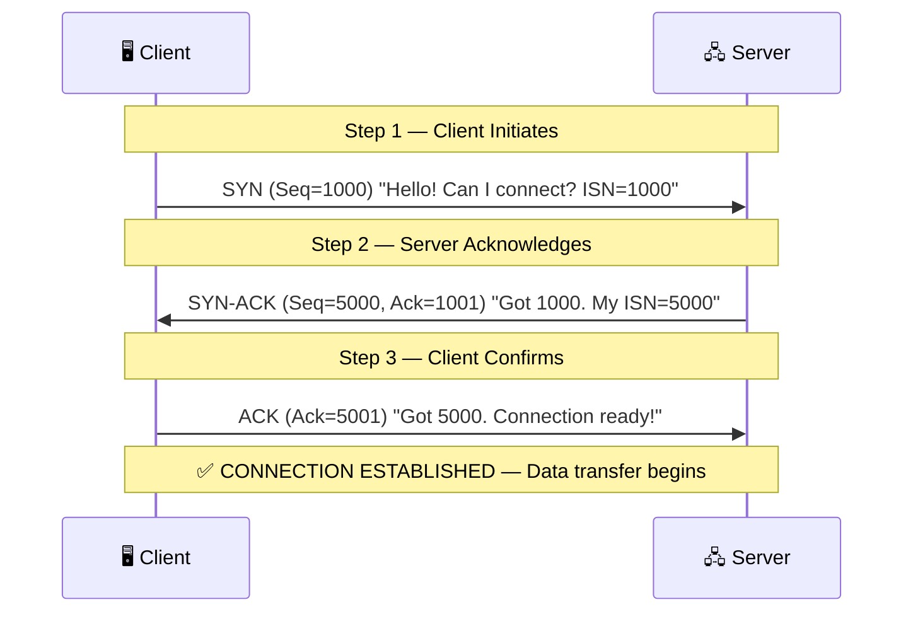
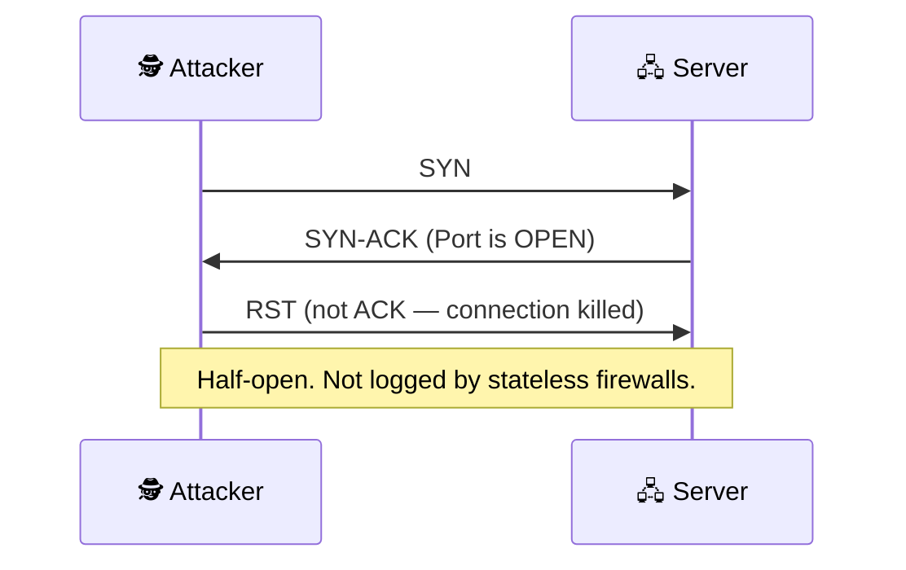
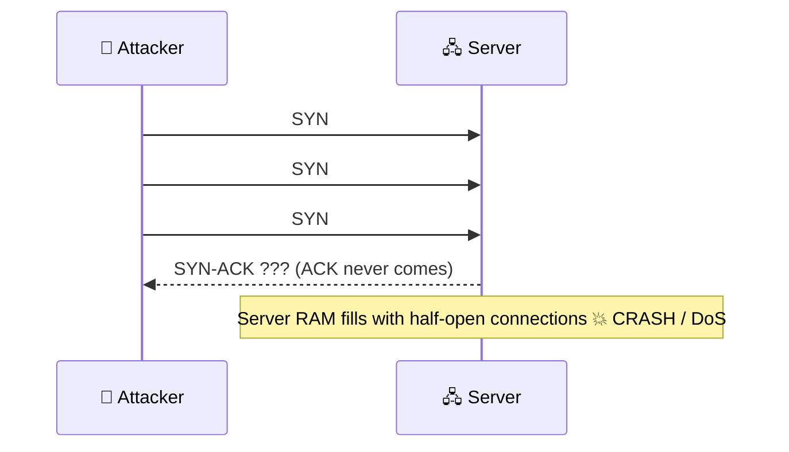
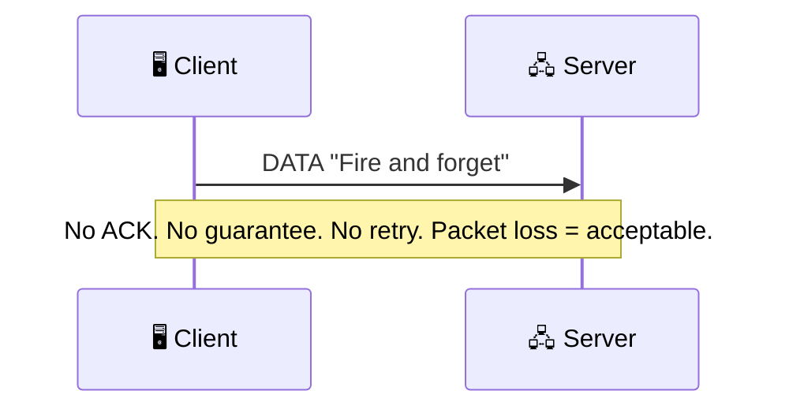
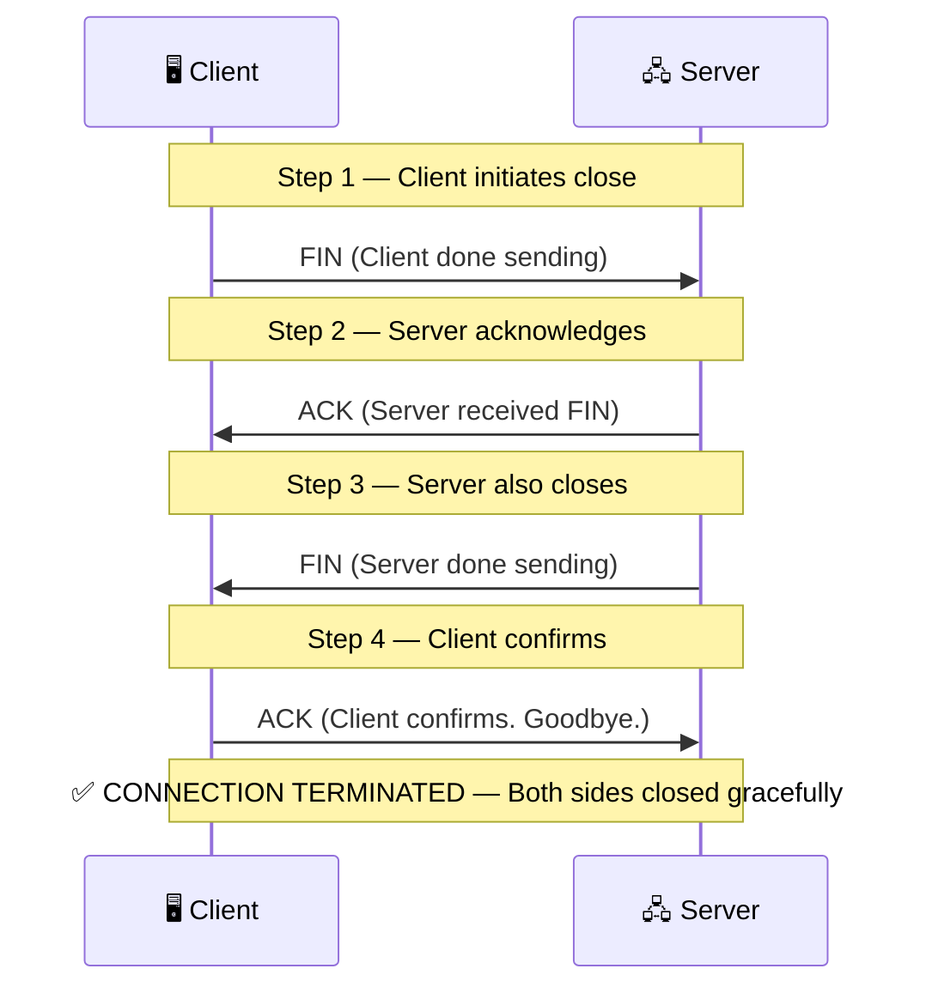

# 🌐 TCP & UDP: Network Protocol Deep-Dive


> *"The handshake is not just a protocol. It is the attack surface."*

A security-focused deep dive into **TCP** and **UDP** covering the 3-Way Handshake, all 6 TCP Flags, SYN Flood attacks, stealth port scans, and Purple Team detection engineering. Built for the desi cybersecurity community.

---

## 📖 Table of Contents

- [TCP: Transmission Control Protocol](#-tcp-transmission-control-protocol)
- [TCP 3-Way Handshake](#-tcp-3-way-handshake)
- [Offensive: SYN Scan vs SYN Flood](#offensive-syn-scan-vs-syn-flood)
- [UDP: User Datagram Protocol](#-udp-user-datagram-protocol)
- [TCP vs UDP Comparison](#tcp-vs-udp-comparison)
- [TCP Flag Family](#-tcp-flag-family)
- [TCP 4-Way Termination](#-tcp-4-way-termination)
- [Advanced Nmap Stealth Scans](#-advanced-nmap-stealth-scans)
- [Purple Team: Detection Engineering](#purple-team-detection-engineering)
- [Key Takeaways](#-key-takeaways)
- [Additional Resources](#-additional-resources)
- [Author](#author)

---

## 📦 TCP: Transmission Control Protocol

**TCP is a Connection-Oriented protocol.** Before any data is sent, both sides must establish a formal agreement via the handshake. Every packet is tracked, acknowledged, and retransmitted if lost.

| Feature | Detail |
|---|---|
| **✓ Reliable Delivery** | Every packet is acknowledged. Lost packets are retransmitted automatically. |
| **⇄ Ordered Data** | Packets arrive in sequence. TCP reassembles them in the correct order. |
| **⧖ Flow Control** | Prevents the sender from overwhelming the receiver using windowing. |

> [!WARNING]
> **The Tradeoff:** TCP reliability comes at a cost of overhead. The handshake, acknowledgements, and retransmissions add latency. This is why real-time applications (gaming, video streaming) prefer UDP.

> [!NOTE]
> **OSI Layer 4 (Transport Layer)** — Port numbers identify services: `HTTP=80` `HTTPS=443` `SSH=22` `DNS=53`

---

## 🤝 TCP 3-Way Handshake

The connection establishment protocol where both parties **synchronize sequence numbers** before any data transfer begins.



---

## ⚔️ Offensive: SYN Scan vs SYN Flood

### Stealth Scan (`nmap -sS`) — Port Reconnaissance

A **half-open scan** that never completes the handshake, avoiding full connection logging on older firewalls.



| Server Response | Interpretation |
|---|---|
| `SYN-ACK` received | ✅ Port is **OPEN** |
| `RST` received | ❌ Port is **CLOSED** |
| No response | 🔶 Port is **FILTERED** |

---

### SYN Flood Attack (DoS)

A **Denial of Service** attack that exhausts server RAM with half-open connections.



> [!IMPORTANT]
> **Fix:** `SYN Cookies` `Rate Limiting` `Firewall SYN threshold rules`

---

## 📡 UDP: User Datagram Protocol

**UDP is connectionless — "fire and forget."** There is no handshake, no ACK, no guaranteed delivery. Speed is the priority.



### Use Cases (Speed > Reliability)

| Application | Reason |
|---|---|
| 🎮 Online Gaming | 1 dropped frame is acceptable |
| 📹 Video Streaming | A slight glitch is better than buffering |
| 🌐 DNS Lookups | Fast single-request/response query |
| 📡 VoIP Calls | Real-time audio requires minimum latency |

---

## ⚖️ TCP vs UDP Comparison

| Feature | TCP | UDP |
|---|---|---|
| **Connection** | Required (3-Way Handshake) | None |
| **Reliability** | Guaranteed delivery | Not guaranteed |
| **Order** | Maintained | Not maintained |
| **Speed** | Slower | Faster |
| **Error Check** | Full | Minimal |
| **Use Case** | HTTP, SSH, FTP | DNS, VoIP, Gaming |
| **Attack Vector** | SYN Flood | UDP Flood / Spoofing |

---

## 🚩 TCP Flag Family

The TCP header carries **6 control flags**. Each controls connection state. **Misuse of flags = attack vector.**

| Flag | Name | Purpose | Security Threat |
|---|---|---|---|
| `SYN` | Synchronize | Initiates a connection. The opening move. | ⚠️ SYN Flood DoS |
| `ACK` | Acknowledge | Confirms receipt. Used in almost every packet. | ⚠️ ACK Flood |
| `FIN` | Finish | Graceful close. "I am done sending." | ⚠️ FIN Scan (`nmap -sF`) |
| `RST` | Reset | Abrupt termination. Error or rejection. | ⚠️ RST Injection |
| `PSH` | Push | Send data to app immediately, skip buffer. | ⚠️ PSH+URG combo scans |
| `URG` | Urgent | Prioritize this data, process before queue. | ⚠️ URG pointer exploits |

---

## 🔌 TCP 4-Way Termination

A **graceful connection teardown** where both sides independently close their half of the connection.



> [!NOTE]
> **Why 4 steps, not 3?** TCP allows **half-close**. Each side independently signals when *it* is done sending. The server may still have data to send after acknowledging the client's FIN.

---

## 🔍 Advanced Nmap Stealth Scans

Exploiting TCP flag logic to bypass firewalls and evade detection.

### Xmas Scan (`nmap -sX`)

Flags Set: FIN + PSH + URG

All 3 flags lit simultaneously. Looks like a "Christmas tree" in a packet analyzer.

| Response | Meaning |
|---|---|
| No response | Port **OPEN** or **FILTERED** |
| `RST` received | Port **CLOSED** |

> **Bypass:** Evades stateless firewalls and old Linux kernel stacks.

---

### FIN Scan (`nmap -sF`)

Flags Set: NONE (zero flags)

Sends a completely empty TCP packet. Abnormal in all real traffic.

| Response | Meaning |
|---|---|
| No response | Port **OPEN** |
| `RST` received | Port **CLOSED** |

> [!WARNING]
> **Windows caveat:** Windows does not follow RFC 793 strictly and may send `RST` for both open and closed ports, making NULL scans unreliable against Windows targets.

---

## 🛡️ Purple Team: Detection Engineering

*If you can attack it, you must know how to detect and defend it.*

### SYN Flood Detection

**Signal:** High volume of `SYN` packets with no corresponding `ACK`.

```bash
# Snort / Suricata Rule
alert tcp any any -> $HOME_NET any (flags:S; detection_filter: track by_dst, count 100, seconds 1;)
```

> **Fix:** SYN Cookies · Rate Limiting · Firewall SYN threshold rules

---

### Xmas / FIN / NULL Scan Detection

**Signal:** TCP packets with illegal or abnormal flag combinations (`FIN+PSH+URG`, or no flags at all).

```bash
# Snort Rule — Xmas Scan
alert tcp any any -> $HOME_NET any (flags:FPU; msg:"XMAS Scan Detected";)
```

> **Fix:** IDS signature rules · Stateful firewall inspection

---

### UDP Flood / Spoofing Detection

**Signal:** High UDP traffic volume to random ports with source IPs changing rapidly.

```bash
# Indicator: Watch for an ICMP Unreachable storm
# (Server responses to closed UDP ports)
tcpdump -i eth0 icmp and 'icmp[icmptype] == icmp-unreach'
```

> **Fix:** Rate limit UDP per source · Ingress filtering (BCP38) · Anycast diffusion

### Detection Toolbox

| Tool | Use Case |
|---|---|
| `Wireshark` | Packet-level inspection and flag analysis |
| `Snort / Suricata` | Signature-based IDS/IPS rule enforcement |
| `Zeek` | Network traffic analysis and behavioral logging |
| `Elastic SIEM` | Centralized log aggregation and alert triage |
| `tcpdump` | Command-line real-time traffic capture |

---

## 💡 Key Takeaways

> [!IMPORTANT]
> **Map the attack. Secure the layer.** Understanding the exact mechanics of TCP and UDP is the foundation of both offensive security and defensive detection engineering.

| # | Takeaway |
|---|---|
| **01** | **TCP is reliable but attackable.** 3-way handshake = connection. Missing ACK = SYN Flood. |
| **02** | **UDP trades safety for speed.** No handshake = easy spoofing. UDP Flood = DoS. |
| **03** | **TCP Flags are your attack surface.** Abnormal flag combos = Xmas, FIN, NULL scans. |
| **04** | **4-Way teardown = graceful exit.** FIN+ACK+FIN+ACK. Half-close is legal. |
| **05** | **Detect what you can attack.** SYN without ACK = flood. Flag combo = scan. Rate spike = UDP flood. |

---

## 🔗 Additional Resources

- 📺 **Watch the Tutorial:** [TCP & UDP Deep Dive — Full Walkthrough in Urdu/Hindi](https://www.youtube.com/@MuhammadAqibTayyab)
- 📊 **Original Deck:** [Download Presentation (PPTX)](./assets/TCP_UDP_Aqib.pptx)
- 🛡️ **Previous Module:** [OSI Model: Network Architecture & Security Deep-Dive](https://github.com/AqibTayyab/OSI-Model-Security-Deep-Dive)
- 💼 **Connect:** [LinkedIn: Muhammad Aqib Tayyab](https://www.linkedin.com/in/muhammad-aqib-tayyab-ethical-hacker/)

---

## 🙋‍♂️ Author

**Muhammad Aqib Tayyab** — AppSec & Purple Team Student | Certified Ethical Hacker | Bug Bounty Hunter

I am an undergraduate **BS-IT student at NUML, Pakistan**, pursuing a *"Learning in Public"* philosophy to document my technical cybersecurity journey and build high-quality, accessible resources for the community.

[](https://www.linkedin.com/in/muhammad-aqib-tayyab-ethical-hacker/)
[](https://www.youtube.com/@MuhammadAqibTayyab)
[](https://github.com/AqibTayyab)

---

> *Part of the **Learning in Public** initiative — providing practical cybersecurity tutorials for the Urdu/Hindi-speaking community.*

`#Cybersecurity` `#TCP` `#UDP` `#NetworkSecurity` `#AppSec` `#PurpleTeam` `#EthicalHacking` `#LearningInPublic` `#Pakistan` `#NUML`
